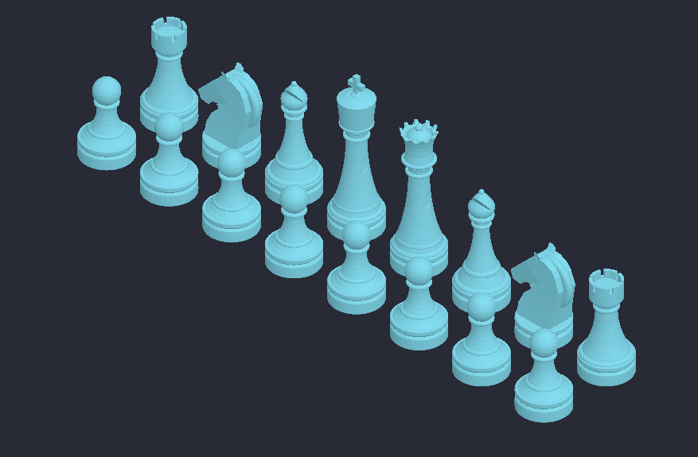

# CHESSBITS

A python script that generates 3D models of chess pieces.
No external drawings or 3d models are imported, all shapes are natively specified with code.



This script can generate:

* pawn
* rook
* knight
* bishop
* queen
* king

In the following formats:

* STL (common filetype for 3D printing)
* STEP (common 'neutral' format for 3D solid modelling programs such as SolidWorks and Inventor)
* .json for Three.js viewing (exports automatically into a 'web_view' folder, which can be viewed with a server)


## Try it Out

[link to Jupyter version coming soon!]


## Installation 

First, download or clone this repository:

`git clone https://github.com/RustyVermeer/chessbits.git`

Then, 

`cd chessbits`


The only python library required is cadquery, which can be installed with the following:

`pip install cadquery`

or (from inside the *chessbits* folder) 

`pip install requirements`

Unfortunately, cadquery has a dependency on *FreeCAD* which requires additional installation on your part.

You can read about how to install FreeCAD on your system by going to [FreeCAD's official downloads page](https://www.freecadweb.org/wiki/Installing).
The official released version of FreeCAD is 0.16, which should work fine with this script. However, *chessbits.py* was developed on a machine that had the FreeCAD 0.17 release installed. Your results may vary.

Once FreeCAD and cadquery are successfully installed, the chessbits script can be run.

## Usage

Basic usage of *chessbits.py* is extremely easy. From your terminal, run:

`python chessbits.py`

This will generate STL files for all pieces in a chess set with default parameters. You can find the resulting files in a new folder called *output*.

To generate pieces with custom specifications, you can modify the *config.py* file. Once you are happy with your settings, run the script with `custom`:

`python chessbits.py custom`

This is the full list of arguements you can pass to the script(order does not matter):

```
    nostl -- prevents the script from generating STL files. By default, STL is the only format output
    WEB -- outputs a .json file to the web_view folder. See below for instrucitons on how to view this.
    STEP -- outputs pieces.step file to the output folder.
    [Piece names] -- generates the specified piece(s). Explicitly specifying piece names prevents other non-named pieces from being generated.
        valid piece names are: pawn, rook, knight, bishop, queen, king (no capitals)
    custom -- tells the script to load the config.py file and generate pieces according to it. Ignores all other arguements. 
```

Some examples:

The following command will create:
* web_view/assembly.json -- will display a *king* and *queen* 
* output/pieces.step -- a single file containing the *king* and *queen* pieces

`python chessbits.py king queen nostl web step`


The following command will create all pieces (in the output/ folder) that are specified in the *config.py* file:

`python chessbits.py custom`


Finally, the following command will create all pieces (in the output/ folder), a step file, and a web_view file, with default values:

`python chessbits.py web step`

To specify custom dimensions for your pieces, please open the config.py file and read the comments there to understand how pieces are specified.

### Using The Web View

The web view is a (rough and simple) WebGL viewer built with Three.js. You can use it quite simply by launching a server:

`cd web_view`
`python -m SimpleHTTPServer`

Then, open up your web browser and navigate to your localhost with the appropriate port.

## If You Like This / Wish to Use it:

Please, go right ahead and use this! I will be 3D printing my own set with this code, and you're more than welcome to do the same. I'd love to see the results. If you want to share, you can let me know on twitter [@RustyVermeer](https://www.twitter.com/rustyvermeer).

I'm also open to improving this script, so feel free to make Pull Requests.

Suggestions for better coding practices? I have a lot to learn, so hit me up with those kinds of issues/PRs as well! :)


## Watch Me Work on this

I stream my programming [on Twitch](https://www.twitch.tv/rustyvermeer) if you would like to see how I built this project up. I'll be doing more projects there, too, so feel free to stay tuned ;). 
